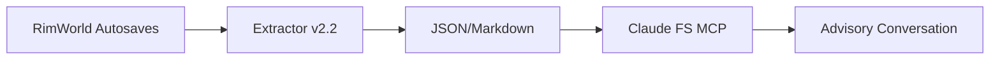
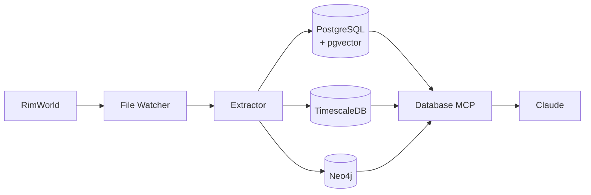
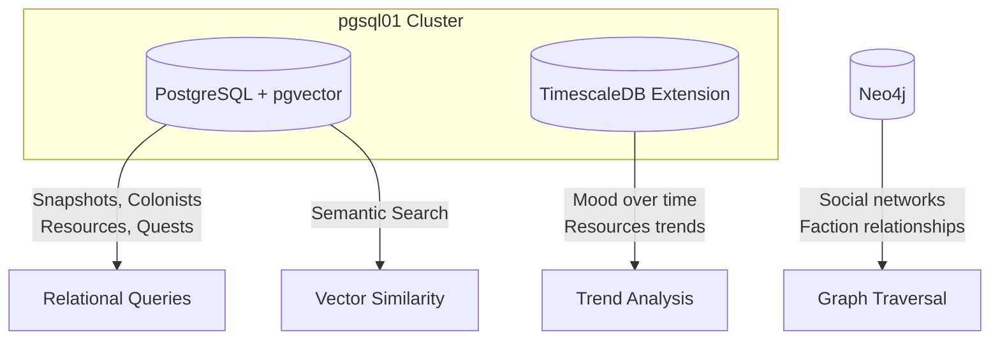

# RimWorld AI Colony Co-Play Architecture

## Overview

RimWorld AI Colony Co-Play is architected as a Context Augmented Generation (CAG) system where Claude provides gameplay advice based on actual extracted game state, not generic knowledge. The architecture separates concerns into three layers: data extraction (Python/lxml tooling), state storage (PostgreSQL with extensions), and advisory interface (Claude via database MCP).

The system follows a pull-based model where extraction runs on-demand or triggered by file changes, producing point-in-time snapshots stored in the database cluster. Claude queries this database during conversations, enabling queries like "how is Viktor's mood trending?" or "are we at risk of food shortage?" with answers grounded in actual game data rather than speculation.

## Core Components

### Schema Discovery Tool
**Purpose:** Walk save file XML tree, map all paths with sample values  
**Location:** `tools/extractor/schema_discovery.py`  
**Status:** ✅ Implemented  
**Key Characteristics:**
- DOM parsing for full tree traversal
- Outputs markdown with tree structure, depths, occurrence counts
- Used to derive extraction paths for v2 extractor

### Save Extractor v2
**Purpose:** Parse RimWorld .rws XML save files into structured JSON  
**Location:** `tools/extractor/rimworld_extractor_v2.py`  
**Status:** ✅ Implemented (v2.2)  
**Key Characteristics:** 
- lxml DOM parsing (file sizes manageable, random access needed)
- Schema-driven paths from actual save analysis
- Dual-audience commenting throughout
- Handles 270+ mod configurations
- ~3 second extraction for 18MB files
- 18+ extraction categories

### State Storage
**Purpose:** Store extracted snapshots and enable historical queries  
**Current:** `state/snapshots/` (JSON/Markdown files)  
**Planned:** Multi-database architecture on pgsql01:
- **PostgreSQL + pgvector** — Relational data, semantic search via embeddings
- **TimescaleDB extension** — Time series for trend analysis (mood, resources over time)
- **Neo4j** — Graph database for relationship networks (colonist social, faction webs)

### File Watcher (Planned)
**Purpose:** Automatically trigger extraction on autosave file changes  
**Location:** `tools/watcher/`  
**Key Characteristics:** Monitors RimWorld saves directory, debounces rapid changes, invokes extractor, writes to databases

### MCP Integration (Planned)
**Purpose:** Enable Claude to query colony data directly  
**Component:** Database MCP connected to pgsql01  
**Key Characteristics:** SQL queries over snapshots, colonists, resources, factions; graph traversal for relationships

## Structure

```
rimworld-ai-colony-coplay/
├── .internal-files/              # Development artifacts (gitignored)
├── .kilocode/
│   ├── rules/memory-bank/        # Agent context files
│   └── workflows/                # KC workflow definitions
├── assets/                       # Project assets (images, diagrams)
├── docs/
│   └── documentation-standards/  # Templates and guidelines
├── game-saves/
│   └── the-fringe-benefit/       # Current test colony (public)
├── mod/                          # C# mod source (Phase 2+)
├── shared/                       # Cross-project utilities
├── state/
│   ├── history/                  # Historical analysis (planned)
│   └── snapshots/                # JSON/Markdown extracts
│       ├── milestone-03-.../     # Milestone captures
│       └── the-fringe-benefit/   # Active colony output
├── tools/
│   ├── extractor/                # Save file parser ✅
│   │   └── parsers/              # Legacy modular parsers
│   └── watcher/                  # File watcher (planned)
└── work-logs/
    ├── 01-ideation-and-setup/    # M01: Complete
    ├── 02-extractor-phase-01/    # M02: Complete
    └── 03-extractor-phase-02/    # M03: Complete
```

## CAG Data Flow

### Current Data Flow (Phase 1)



### Target Architecture



### Database Responsibilities



## Database Schema (Planned)

### PostgreSQL Tables

```sql
-- Core snapshot tracking
snapshots (
  id SERIAL PRIMARY KEY,
  extracted_at TIMESTAMPTZ,
  game_ticks BIGINT,
  game_year INT,
  game_day INT,
  quadrum VARCHAR(20),
  colony_name VARCHAR(100),
  storyteller VARCHAR(100),
  difficulty VARCHAR(50)
)

-- Colonist state per snapshot
colonists (
  id SERIAL PRIMARY KEY,
  snapshot_id INT REFERENCES snapshots(id),
  pawn_id VARCHAR(50),
  name VARCHAR(100),
  gender VARCHAR(20),
  biological_age FLOAT,
  mood FLOAT
)

-- Skills per colonist
skills (
  id SERIAL PRIMARY KEY,
  colonist_id INT REFERENCES colonists(id),
  skill_def VARCHAR(50),
  level INT,
  passion VARCHAR(20),
  xp FLOAT
)

-- Resources per snapshot
resources (
  id SERIAL PRIMARY KEY,
  snapshot_id INT REFERENCES snapshots(id),
  item_def VARCHAR(100),
  count INT
)

-- Faction relations per snapshot
faction_relations (
  id SERIAL PRIMARY KEY,
  snapshot_id INT REFERENCES snapshots(id),
  faction_name VARCHAR(100),
  faction_def VARCHAR(100),
  goodwill INT,
  relation_kind VARCHAR(20)
)

-- Buildings per snapshot
buildings (
  id SERIAL PRIMARY KEY,
  snapshot_id INT REFERENCES snapshots(id),
  building_def VARCHAR(100),
  category VARCHAR(50),
  count INT
)

-- Quests per snapshot
quests (
  id SERIAL PRIMARY KEY,
  snapshot_id INT REFERENCES snapshots(id),
  quest_name VARCHAR(200),
  status VARCHAR(20),
  challenge_rating INT
)
```

### TimescaleDB Hypertables

```sql
-- Time series for colonist metrics
colonist_metrics (
  time TIMESTAMPTZ NOT NULL,
  pawn_id VARCHAR(50),
  mood FLOAT,
  rest FLOAT,
  food FLOAT,
  recreation FLOAT
)
-- SELECT create_hypertable('colonist_metrics', 'time');

-- Time series for resource levels
resource_levels (
  time TIMESTAMPTZ NOT NULL,
  item_def VARCHAR(100),
  count INT
)
-- SELECT create_hypertable('resource_levels', 'time');
```

### Neo4j Graph Model

```
(:Colonist {pawn_id, name})
(:Faction {name, def})
(:Colonist)-[:OPINION {value}]->(:Colonist)
(:Colonist)-[:RELATIONSHIP {kind}]->(:Colonist)
(:Colonist)-[:MEMBER_OF]->(:Faction)
(:Faction)-[:GOODWILL {value}]->(:Faction)
```

## Architectural Decisions

### AD-001: External System vs. Game Mod
**Date:** 2026-01-17  
**Decision:** Phase 1 operates entirely outside the game, reading autosaves  
**Rationale:** Faster to implement, no mod development required, zero game impact  
**Status:** Implemented ✅

### AD-002: DOM Parsing over Streaming
**Date:** 2026-01-18  
**Decision:** Use lxml DOM parsing instead of iterparse streaming  
**Rationale:** File sizes (~18MB) manageable, random access simplifies cross-referencing (e.g., faction ID → name lookups)  
**Status:** Implemented ✅

### AD-003: Schema-Driven Extraction
**Date:** 2026-01-18  
**Decision:** Run schema_discovery.py to map actual XML paths, not hardcode guesses  
**Rationale:** v1 extractor returned "Unknown" for many fields due to incorrect path assumptions  
**Status:** Implemented ✅

### AD-004: Multi-Database Architecture
**Date:** 2026-01-18  
**Decision:** Use PostgreSQL + TimescaleDB + Neo4j instead of single database  
**Rationale:** Each database optimized for its query pattern — relational for snapshots, time series for trends, graph for relationships  
**Status:** Planned

### AD-005: CAG over RAG
**Date:** 2026-01-18  
**Decision:** Context Augmented Generation using live game data, not document retrieval  
**Rationale:** Real colony state enables specific advice, not generic RimWorld knowledge  
**Status:** Architecture defined

### AD-006: Dual-Audience Commenting
**Date:** 2026-01-18  
**Decision:** Apply AI NOTEs for hidden constraints, human-first comments for intent  
**Rationale:** Code will be maintained by both humans and AI agents  
**Status:** Implemented ✅

## Extraction Capabilities

| Category | Status | Notes |
|----------|--------|-------|
| Meta (version, mods) | ✅ | 270 mods |
| Game Time | ✅ | Year, day, quadrum, hour |
| Storyteller | ✅ | From components/li |
| Difficulty | ✅ | From components/li |
| Weather | ✅ | Current + last |
| Colony Stats | ✅ | Adaptation, raids, population |
| Factions | ✅ | 20+ with relations, goodwill |
| Research | ✅ | 45+ completed, current project |
| Colonists | ✅ | 7 with full profiles |
| Animals | ✅ | 2 with training |
| Resources | ✅ | Dynamic discovery |
| Buildings | ✅ | 1002 categorized |
| Zones | ✅ | 8 with details |
| Power Network | ✅ | Batteries, generators, fuel |
| Play Log | ✅ | Social interactions |
| Battle Log | ✅ | Combat events |
| Tales | ✅ | Colony events |
| Quests | ✅ | 23 with status |
| World Objects | ✅ | 441 (settlements, ruins, sites) |
| Work Tab | ✅ | 225 workgivers per pawn |
| Map Grid | ✅ | Building/pawn positions |

## Constraints and Limitations

- **Save-time granularity:** Only captures state when RimWorld writes autosave
- **No write capability (Phase 1):** Cannot modify game state, advisory only
- **Work Tab names:** Currently shows Thing_HumanXXXXX, not resolved to colonist names
- **Power rates:** Production/consumption not in saves — calculated at runtime from ThingDef XMLs

## Future Considerations

### Planned Improvements
- PostgreSQL + pgvector storage on pgsql01
- TimescaleDB extension for time series trends
- Neo4j for colonist/faction relationship graphs
- File watcher for automatic extraction
- Database MCP for Claude queries
- Progress Renderer correlation
- Work Tab pawn name resolution

### Scalability Considerations
- May need incremental parsing if saves grow larger
- Historical storage may require pruning policy
- Consider event-triggered saves for higher resolution

### Technical Debt
- Work Tab shows pawn IDs, not names
- Legacy v1 extractor still in repo (reference only)
