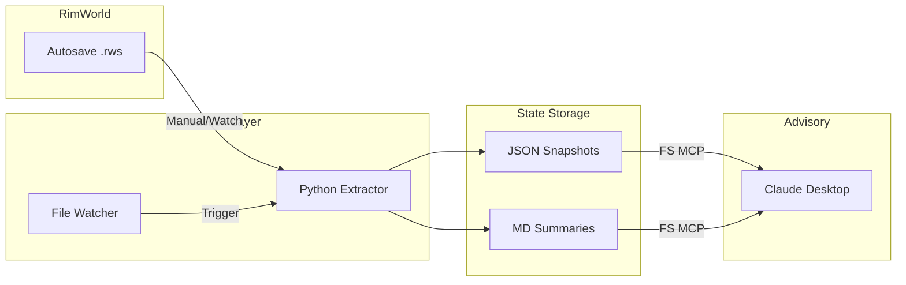

<!--
---
title: "RimWorld AI Colony Co-Play"
description: "External AI advisor for RimWorld colony management via save file analysis"
author: "VintageDon"
date: "2026-01-17"
version: "0.1.0"
status: "Development"
tags:
  - type: project-root
  - domain: gaming
  - domain: ai-integration
  - tech: python
  - tech: xml-parsing
related_documents:
  - "[Extractor Handoff](docs/rimworld-extractor-handoff.md)"
  - "[Memory Bank](/.kilocode/rules/memory-bank/README.md)"
---
-->

# 🎯 RimWorld AI Colony Co-Play

[](https://python.org)
[](https://rimworldgame.com)
[](https://claude.ai)
[](LICENSE)

> External AI advisor that reads RimWorld colony state and provides strategic guidance through natural conversation.

RimWorld AI Colony Co-Play enables Claude to serve as an intelligent colony advisor without modifying the game. By parsing save files and maintaining historical context, Claude can answer questions about colonist status, identify emerging risks, and suggest optimizations grounded in actual game data rather than general knowledge.

---

## 🔭 Overview

This project explores a novel human-AI collaboration pattern: co-playing a complex simulation game where the AI has persistent memory of colony history and provides advice based on real game state. If you're familiar with RimWorld modding and just want to run the extractor, skip to [Quick Start](#-quick-start).

### The Problem

Existing RimWorld AI mods (like RimAI Framework/Core) add in-game terminals and UI elements that change the gameplay experience. There's no solution for using an external AI assistant that simply reads game state and advises without modifying the game itself.

Additionally, getting useful AI advice about a specific colony currently requires manually describing the situation — tedious, incomplete, and loses context between sessions.

### The Solution

This project takes a different approach: Claude operates as an external advisor reading autosave files. The system extracts colony state into structured data Claude can query, maintains timestamped snapshots for trend analysis, and preserves context across play sessions.

The result is an AI companion that knows your colonists by name, remembers that Viktor had a mental break last week, notices your steel reserves declining, and can warn you about the skill gaps in your colony composition.

---

## 🎯 Target Audience

| Audience | Use Case |
|----------|----------|
| RimWorld Players | AI-assisted colony optimization and strategic planning |
| AI Experimenters | Novel human-AI collaboration patterns in gaming |
| Developers | Reference implementation for game state extraction |

---

## 📊 Project Status

| Phase | Status | Description |
|-------|--------|-------------|
| Phase 1: Save Extraction | 🔄 In Progress | Python extractor parsing .rws files to JSON |
| Phase 1: File Watcher | ⬜ Planned | Automatic extraction on autosave |
| Phase 2: Export Mod | ⬜ Future | C# mod for real-time state export |
| Phase 3: Interaction | ⬜ Future | Limited game interaction capabilities |

### Current Milestone

**M01: Ideation and Setup** — Repository scaffolding and documentation complete. Ready for M02 (GitHub project setup) and extractor development.

---

## 🏗️ Architecture

The system operates as a read-only external observer during Phase 1, with no game modifications required.

### Data Flow



### Components

| Component | Technology | Purpose |
|-----------|------------|---------|
| Save Extractor | Python 3.10+ | Parse XML saves into structured JSON |
| State Storage | JSON/Markdown | Timestamped snapshots and summaries |
| File Watcher | Python (future) | Auto-trigger extraction on save |
| Claude Integration | FS MCP | Read state during conversations |

---

## 📁 Repository Structure

```
rimworld-ai-colony-coplay/
├── 📂 game-saves/            # Colony save files (gitignored for now)
├── 📂 .kilocode/             # Agent memory bank
├── 📂 .reference-data/       # RimAI mod source reference (gitignored)
├── 📂 tools/                 # Python tooling
│   ├── extractor/            # Save file parser
│   └── watcher/              # File watcher (future)
├── 📂 state/                 # Extracted game state (gitignored)
│   ├── snapshots/            # Point-in-time JSON
│   └── history/              # Historical diffs
├── 📂 mod/                   # C# mod source (Phase 2+)
├── 📚 docs/                  # Documentation
├── 📂 work-logs/             # Development milestones
├── 📄 LICENSE
└── 📄 README.md              # This file
```

---

## 🎮 Extraction Capabilities

The extractor targets 13 data categories from RimWorld saves:

| Category | Data Extracted |
|----------|----------------|
| Colonists | Skills, traits, health, mood, needs, relationships, genes |
| Resources | Inventory counts, storage utilization |
| Research | Completed, in-progress, available |
| Factions | Relations, goodwill, recent interactions |
| Buildings | Key structures, power grid, defenses |
| Zones | Stockpiles, growing zones, restrictions |
| Animals | Tamed, bonded, training status |
| Environment | Weather, temperature, season, biome |
| Threats | Active raids, mechanoids, infestations |
| Economy | Silver, trade goods, caravan capacity |
| Priorities | Work priorities, schedules, restrictions |
| Events | Recent incidents, upcoming triggers |
| World | Map tiles, settlements, faction bases |

---

## 🔬 Related Projects

| Project | Relationship |
|---------|--------------|
| [RimAI Framework](https://github.com/rimworld-ai/RimAI.Framework) | Reference for LLM integration patterns |
| [RimAI Core](https://github.com/rimworld-ai/RimAI.Core) | Reference for game state extraction |

These mods take the in-game terminal approach. This project studies their implementation for reference while pursuing the external advisor pattern.

---

## 🚀 Getting Started

### Prerequisites

- Python 3.10 or higher
- RimWorld with autosave enabled (1-2 minute interval recommended)
- Claude Desktop with FS MCP access to this repository

### Quick Start

```powershell
# Clone repository
git clone https://github.com/vintagedon/rimworld-ai-colony-coplay.git
cd rimworld-ai-colony-coplay

# Run extraction (once extractor is built)
python tools/extractor/rimworld_extractor.py "path/to/save.rws" -o state/snapshots/

# Start Claude conversation in this project context
# Claude can now read from state/snapshots/ via FS MCP
```

### Configuration

RimWorld saves are located at:
```
C:\Users\{username}\AppData\LocalLow\Ludeon Studios\RimWorld by Ludeon Studios\Saves\
```

Configure autosave frequency in RimWorld options for more granular state tracking.

---

## 📄 License

This project is licensed under the MIT License — see [LICENSE](LICENSE) for details.

---

## 🙏 Acknowledgments

- **Ludeon Studios** — RimWorld and its moddable architecture
- **RimAI Team** — Reference implementations for AI integration
- **Anthropic** — Claude and the MCP ecosystem
- **Open source community** — Python XML parsing libraries

---

Last Updated: 2026-01-17 | Phase 1 Development
