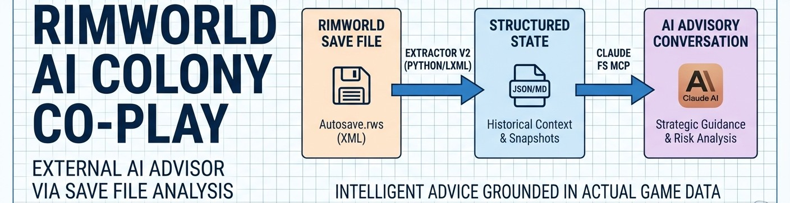
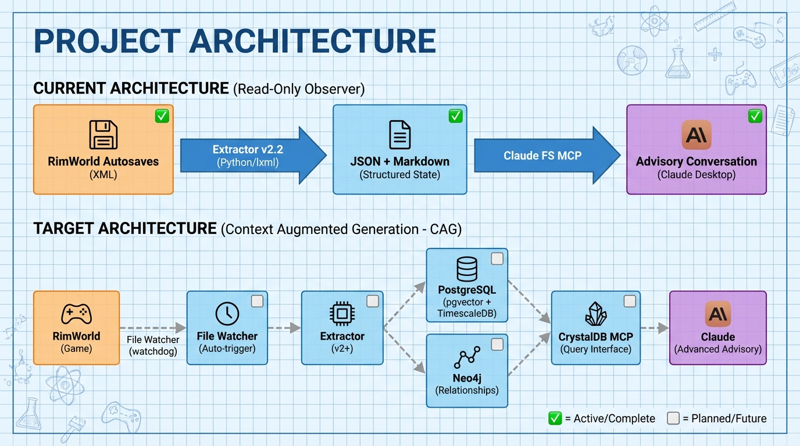

<!--
---
title: "RimWorld AI Colony Co-Play"
description: "External AI advisor for RimWorld colony management via save file analysis"
author: "VintageDon"
date: "2026-01-19"
version: "0.4.0"
status: "Development"
tags:
  - type: project-root
  - domain: gaming
  - domain: ai-integration
  - tech: python
  - tech: lxml
  - tech: xml-parsing
related_documents:
  - "[Memory Bank](.kilocode/rules/memory-bank/README.md)"
---
-->

# 🎯 RimWorld AI Colony Co-Play

[](https://python.org)
[](https://rimworldgame.com)
[](https://claude.ai)
[](LICENSE)



> External AI advisor that reads RimWorld colony state and provides strategic guidance through natural conversation.

RimWorld AI Colony Co-Play enables Claude to serve as an intelligent colony advisor without modifying the game. By parsing save files and maintaining historical context, Claude can answer questions about colonist status, identify emerging risks, and suggest optimizations grounded in actual game data rather than general knowledge.

---

## 🔭 Overview

This project explores a novel human-AI collaboration pattern: co-playing a complex simulation game where the AI has persistent memory of colony history and provides advice based on real game state.

### The Approach

Claude operates as an external advisor reading autosave files. The system extracts colony state into structured data Claude can query, maintains timestamped snapshots for trend analysis, and preserves context across play sessions.

The result is an AI companion that knows your colonists by name, remembers that Viktor had a mental break last week, notices your steel reserves declining, and can warn you about the skill gaps in your colony composition.

---

## 📊 Project Status

| Milestone | Status | Description |
|-----------|--------|-------------|
| M01: Ideation & Setup | ✅ Complete | Repository scaffolding, documentation |
| M02: Extractor Phase 1 | ✅ Complete | Schema discovery, base extractor (v2.0) |
| M03: Extractor Phase 2 | ✅ Complete | Full extraction suite, Work Tab, dual-audience comments (v2.2) |
| M04: Extractor Phase 3 | ✅ Complete | Kaggle expansion — deep pawn, world state, containers (v2.3) |
| M05: Database Storage | ⬜ Planned | PostgreSQL with pgvector + TimescaleDB |
| M06: File Watcher | ⬜ Planned | Auto-extract on new saves |
| M07: MCP Integration | ⬜ Planned | CrystalDB MCP for Claude queries |
| Phase 2: Export Mod | ⬜ Future | C# mod for real-time state export |

### Current Capabilities (v2.3)

The extractor processes 18MB+ modded save files in ~3 seconds with comprehensive extraction across colony state, pawn psychology, genetics, social graphs, and world population.

#### Colony State

| Category | Status | Test Colony Values |
|----------|--------|-------------------|
| Meta (version, mods) | ✅ | 270+ mods |
| Game Time | ✅ | Year 5501, Aprimay |
| Storyteller & Difficulty | ✅ | Ariadne Archduchess |
| Factions | ✅ | 20+ with bidirectional goodwill |
| Buildings | ✅ | 1,002 categorized |
| Zones | ✅ | 8 (growing + stockpile) |
| Research | ✅ | 45 completed projects |
| Resources (deep) | ✅ | Recursive container scanning |
| Quests | ✅ | Active/completed with status derivation |
| World Objects | ✅ | 441 (settlements, Real Ruins, sites) |
| Work Tab | ✅ | 225 workgivers/pawn (0-9 scale) |
| Power Network | ✅ | Batteries, generators, fuel levels |
| Play/Battle Logs | ✅ | Social + combat events |
| Tales | ✅ | Colony history events |

#### Pawn Extraction

| Field | Status | Notes |
|-------|--------|-------|
| Identity | ✅ | Name, age, gender, faction |
| Skills | ✅ | All skills with level + passion |
| Traits | ✅ | Full trait list |
| Health | ✅ | Hediffs (injuries, conditions, implants) |
| Needs | ✅ | Current need levels |
| Relations | ✅ | Family and social relations |
| Apparel | ✅ | Worn items with def, stuff, quality, health |
| Primary Weapon | ✅ | Equipped weapon with quality |
| Immunity | ✅ | Disease immunity progress per hediff |
| Memories | ✅ | Thought memories (mood breakdown) |
| Opinions | ✅ | `opinion_offset` from social graph edges |
| Genes | ✅ | Xenotype, endogenes, xenogenes (Biotech DLC) |
| Psycasts | ✅ | Abilities, entropy, psyfocus (Royalty DLC) |

#### World State

| Category | Status | Notes |
|----------|--------|-------|
| World Pawns | ✅ | 357 NPCs across 4 collections (dead, captured, left, mothballed) |
| Kidnapped | ✅ | Per-faction captive tracking |
| Settlements | ✅ | 371 faction bases |
| Real Ruins | ✅ | 50 POIs with wealth data |

---

## 🏗️ Architecture

The system operates as a read-only external observer, progressing toward a Context Augmented Generation (CAG) architecture.

### Current Data Flow



### Components

| Component | Technology | Status |
|-----------|------------|--------|
| Schema Discovery | Python / lxml | ✅ Working |
| Save Extractor v2.3 | Python / lxml | ✅ Working |
| State Storage | JSON/Markdown | ✅ Working |
| Database | PostgreSQL + pgvector + TimescaleDB | ⬜ Planned |
| Graph Database | Neo4j | ⬜ Planned |
| File Watcher | Python watchdog | ⬜ Planned |
| Claude Integration | CrystalDB MCP | ⬜ Planned |

---

## 📁 Repository Structure

```
rimworld-ai-colony-coplay/
├── 📂 assets/                # Project assets (images, diagrams)
├── 📂 docs/                  # Documentation and standards
├── 📂 game-saves/            # Colony save files
│   └── the-fringe-benefit/   # Current test colony (public)
├── 📂 mod/                   # C# mod source (Phase 2+)
├── 📂 scratch/               # Planning documents
├── 📂 shared/                # Cross-project utilities
├── 📂 state/                 # Extracted game state
│   └── snapshots/            # JSON/Markdown output
├── 📂 tools/                 # Python tooling
│   ├── extractor/            # Save file parser ✅
│   └── watcher/              # File watcher (planned)
├── 📂 work-logs/             # Development milestones
└── 📂 .kilocode/             # Agent memory bank
```

---

## 🚀 Getting Started

### Prerequisites

- Python 3.10 or higher
- lxml library (`pip install lxml`)
- RimWorld 1.6 with autosave enabled
- Claude Desktop with FS MCP access to this repository

### Quick Start

```powershell
# Clone repository
git clone https://github.com/vintagedon/rimworld-ai-colony-coplay.git
cd rimworld-ai-colony-coplay

# Install dependencies
pip install lxml

# Run extraction on a save file
cd tools/extractor
python rimworld_extractor_v2.py "<path_to_save.rws>" -o ..\..\state\snapshots\

# Review output
Get-Content ..\..\state\snapshots\colony_*.md | Select-Object -First 100
```

### Configuration

RimWorld saves are located at:

```
C:\Users\{username}\AppData\LocalLow\Ludeon Studios\RimWorld by Ludeon Studios\Saves\
```

---

## 🔬 Related Projects

Other RimWorld mods exploring AI integration:

| Project | Approach | Focus |
|---------|----------|-------|
| [RimTalk](https://steamcommunity.com/sharedfiles/filedetails/?id=3551203752) | In-game, multi-provider LLM | Colonist conversations |
| [RiMind](https://steamcommunity.com/sharedfiles/filedetails/?id=3562373405) | In-game, optimized RimTalk fork | Performance-focused dialogue |
| [RimGPT](https://steamcommunity.com/sharedfiles/filedetails/?id=2960127000) | In-game, ChatGPT + Azure TTS | AI commentator with voice |
| [Legends Ledger](https://steamcommunity.com/sharedfiles/filedetails/?id=3642805704) | In-game world history | DF-style lore generation |
| [Local AI Social](https://steamcommunity.com/sharedfiles/filedetails/?id=3413305419) | In-game, Ollama | Local LLM dialogue |

Our approach differs: external advisory via save file analysis rather than in-game integration. These projects are complementary — use RimTalk for colonist chatter and our system for strategic advisory.

---

## 📄 License

This project is licensed under the MIT License — see [LICENSE](LICENSE) for details.

---

## 🙏 Acknowledgments

- Ludeon Studios — RimWorld and its moddable architecture
- Anthropic — Claude and the MCP ecosystem
- lxml Project — Efficient XML parsing

---

Last Updated: 2026-01-19 | M04 Complete | Extractor v2.3
